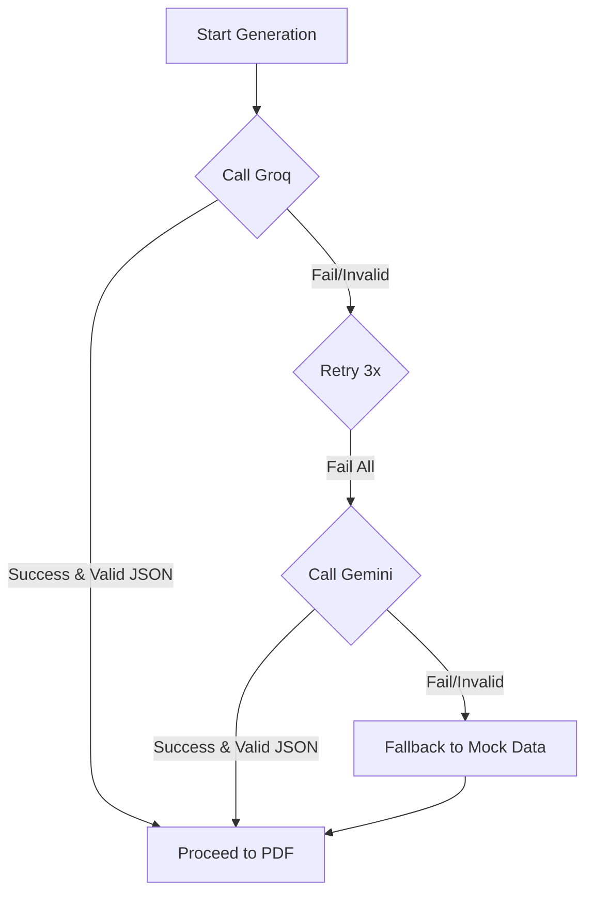

# AI Question Paper Generator - Production Infrastructure

A production-grade, full-stack application leveraging high-performance AI inference and asynchronous processing.

## 🏗️ Architecture Overview

The system is designed for high reliability and scalability:

1.  **High-Speed Inference:** Uses **Groq** (Primary) as the fastest LLM inference engine.
2.  **Robust Fallback:** Automatically switches to **Google Gemini** if Groq is unavailable or returns invalid data.
3.  **Strict Validation:** Uses **Zod** to validate AI JSON outputs against a deterministic schema.
4.  **Async Processing:** Jobs are managed by **BullMQ** & **Redis** to ensure the API remains responsive during long AI generations.
5.  **Real-Time Sync:** **Socket.io** provides live updates on generation progress, errors, and completion.
6.  **Persistence:** **MongoDB Atlas** support for production-grade data storage.

---

## 🤖 AI Fallback Flow



---

## 🚀 Deployment Guide

### Local Development (Manual)

1.  **Clone & Install:**
    ```bash
    git clone <repo>
    cd server && npm install
    cd .. && npm install
    ```
2.  **Environment Setup:**
    Create `.env` in root and `server/.env` based on `.env.example` files.
3.  **Start Infrastructure:**
    Ensure MongoDB and Redis are running locally.
4.  **Run Dev Servers:**
    ```bash
    # Terminal 1: Backend
    cd server && npm run dev
    # Terminal 2: Frontend
    npm run dev
    ```

### Production Deployment (MongoDB Atlas)

1.  Set `MONGODB_URI` to your Atlas connection string: `mongodb+srv://<user>:<pass>@cluster...`
2.  Ensure `GROQ_API_KEY` and `GEMINI_API_KEY` are properly configured in your CI/CD or secrets manager.
3.  Run the build command: `npm run build` in both directories.

### Docker Deployment (Recommended)

```bash
# Pass AI keys as env variables
export GROQ_API_KEY=your_key
export GEMINI_API_KEY=your_key

docker-compose up --build
```

---

## 🛠️ Tech Stack
- **Frontend:** Next.js 15, TailwindCSS v4, Zustand, Socket.io-client
- **Backend:** Node.js, Express, BullMQ, Redis, Mongoose
- **AI:** Groq (Llama 3.3), Google Gemini 1.5
- **Utilities:** Zod, PDFKit, Multer

## 🔍 Troubleshooting
- **Redis Connection:** Ensure Redis is accessible on port 6379. In Docker, use the service name `redis`.
- **JSON Parsing:** The system includes a JSON repair layer to strip markdown code blocks automatically.
- **Rate Limits:** If Groq rate limits are hit, the system will wait for exponential backoff or switch to Gemini.
